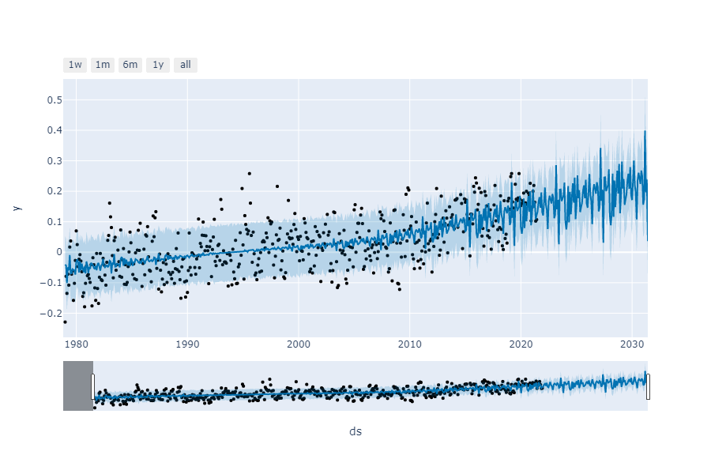

# Is the World as we know it coming to an end?

Saying that it is going to end completely seems a bit extreme, however after taking a look at all the data available it's clear that a negative change is on the horizon. Using Machine Learning and Predictive Models we wanted to take a deeper dive into the data of our previous global warming project and see if the past is any indication of the future. We took a look at the monthly average temperatures from Fort Pulaski in Savannah, GA between 1979 and 2021. This graph is showing us there is a slight upwards trend in the average temperature from month to month, especially during the winter months which are plotted at the bottom of the graph.

 The number range in the data doesn't seem to be that large now, only changing by a few degrees here and there, but let's keep in mind that the planet is 4.5 BILLION years old. So these lines may seem insignificant at the moment but what happens when you look at the trends for one thousand years from now, ten thousand years, a million? Rising temperatures lead to other things such as melting ice caps and rising sea levels. These things are all affected by one another in some way.  Below you can see a prediction graph of rising sea levels at Savannah, GA in just the next ten years.

These are just a couple visualizations from one place, but this is happening all over the planet. You can see for yourself by trying out the model using your own data set here [Weather Predictions](https://colab.research.google.com/drive/1pwT_ncw3XowY0l5NNW8TbkBCcFKExJsA?usp=sharing) and adapting it to fit your needs. If we continue on this path of abusing the only planet we have to live on, there is bound to be a breaking point where the elements strike back and true devistation ensues. It's time to stop just putting a band-aid over the issues and hope they will heal themselves, we need to get to the root of the problem and truely make a change if we are going to see any positive impact in our lifetime.